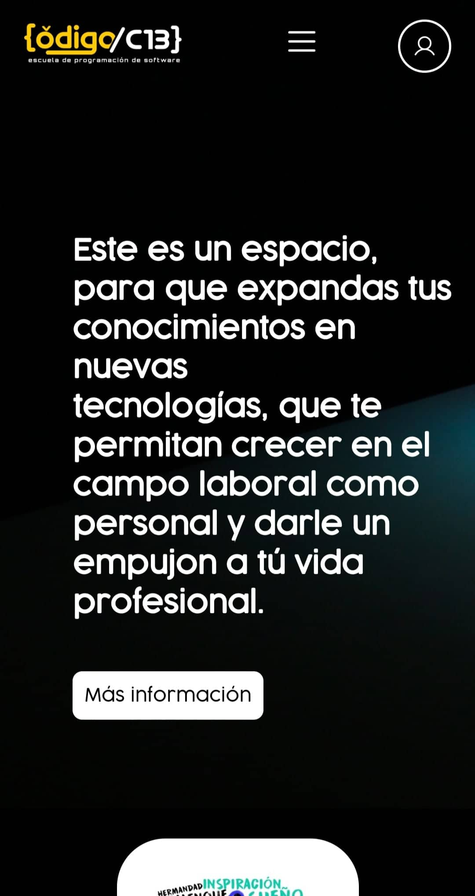

# Proyecto integrado escuelas de codigo

este proyecto es para crear pagina para escuelas de codigoc13

## Screenshots

## version

version 0.2.1 (22/08/2022)

- Creación del sitio web mejorando la propuesta anterior, donde damos colores más neutros usamos colores más expresivos y dimos un vuelco al nuevo estilo.
- Ingramos varias posibilidades como la edición de la barra de navegación, e incrustamos scripts que ayudan a la presencia visual del proyecto.

version 0.2.2 (24/08/2022)

- Arreglamos el responsive de la pagina para moviles.
- Arreglamos el JavaScript de la pagina.
- Invertimos algonos colores.
- Aplicamos botones para la seccion de noticias.
- Derogamos una session de nav y solo usaremos 2 de ellas.
- le agregamos texto a las noticias.
- Cambiamos el color de fondo, del menu responsive, Totop.
- incrustamos las cajas.

